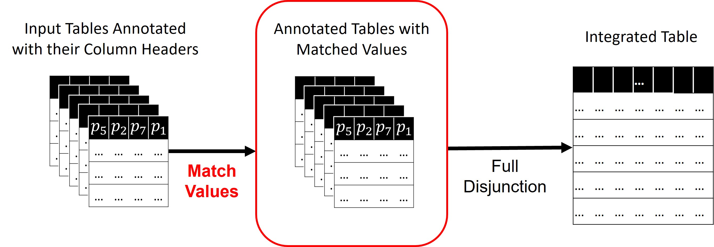

# Fuzzy Integration of Data Lake Tables 

Anonymous Authors

*Block Diagram of Fuzzy Full Disjunction*

## Abstract

Data integration is an important step in any data science pipeline where the objective is to unify the information available in different datasets for comprehensive analysis. Full Disjunction, which is an associative extension of the outer join operator, has been shown to be an effective operator for integrating datasets. It fully preserves and combines the available information. Existing Full Disjunction algorithms only consider the equi-join scenario where only tuples having the same value on joining columns are integrated. This, however, does not realistically represent an open data scenario, where datasets come from diverse sources with inconsistent values (e.g., synonyms, abbreviations, etc.) and with limited metadata. So, joining just on equal values severely limits the ability of Full Disjunction to fully combine datasets. Thus, in this work, we propose an extension of Full Disjunction to also account for ``fuzzy'' matches among tuples. We present a novel data-driven approach to enable the joining of approximate or fuzzy matches within Full Disjunction. Experimentally, we show that fuzzy Full Disjunction does not add significant time overhead over a SOTA Full Disjunction implementation and also that it enhances the integration effectiveness.

## Repository Organization

- **alite_system** contains ALITE full disjunction code from its [original implementation](https://github.com/northeastern-datalab/alite).
- **benchmark** folder contains the sub-folders for some datasets and placeholder for additional datasets.
- **entity_matching** folder contains data and code for the downstreaming task of entity resolution. We use [py_entitymatching](https://github.com/anhaidgroup/py_entitymatching) package.
- **fuzzy_fd.jpg** file shows the block diagram of Fuzzy Full Disjunction system.
- **README.md** file explains the repository.
- **requirements.txt** file contains necessary packages to run the project.
- **plots** folder contains the plots reported in the paper.
- **stats** folder contains experimental statistics reported in the paper.

## Setup

1. Clone the repo

2. CD to the repo directory. Create and activate a virtual environment for this project. We recommend using python version 3.8 or higher.  
  * On macOS or Linux:
      ```
      python3 -m venv env
      source env/bin/activate
      which python
      ```
  * On windows:
      ```
      python -m venv env
      .\env\Scripts\activate.bat
      where.exe python
      ```

3. Install necessary packages. 
   ```
   pip install -r requirements.txt
   ```

## Reproducibility

1. CD to the repo.

2. To run effectiveness experiments on fuzzy value match, run effectivenss_evaluation.py script by updating the embeddings.

2. To run effectiveness experiments on entity matching, CD to entity_matching and run entity_matching.ipynb notebook.

3. To run efficiency experiments, run efficiency_evaluation.py script.